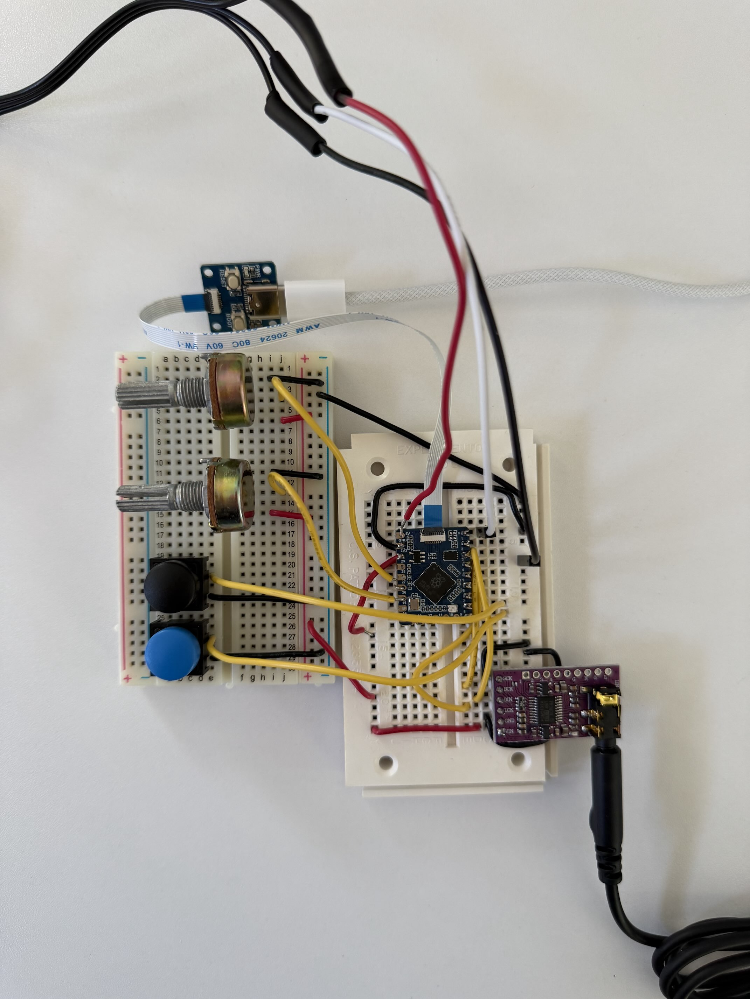
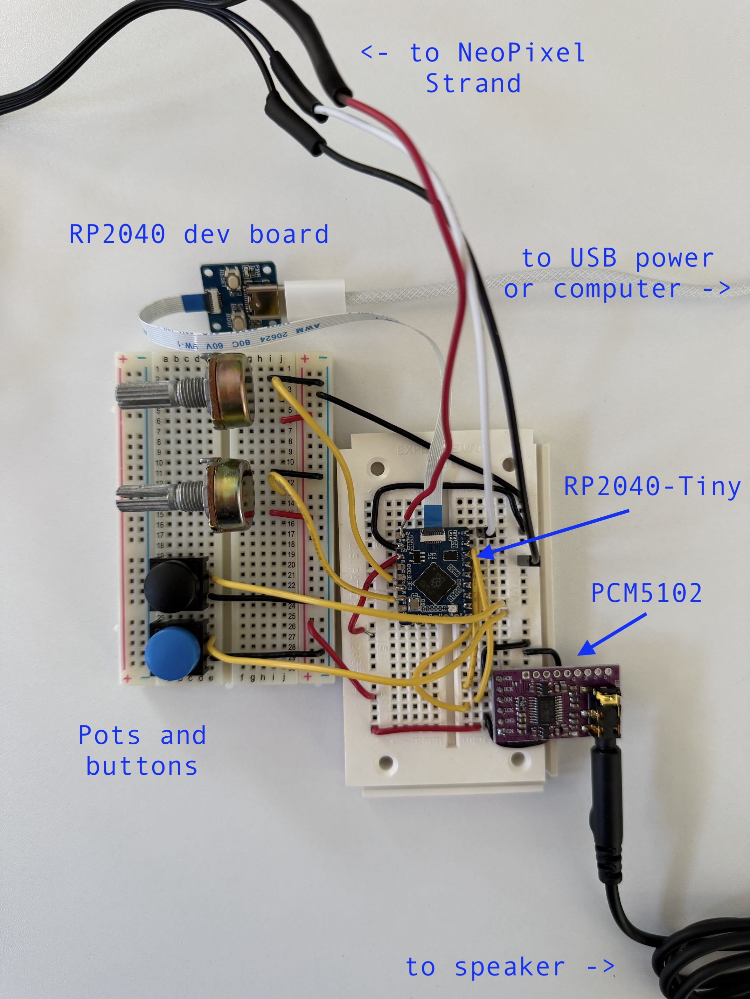

# ARPSYNTH

## Parts
- Raspberry Pi Pico or clone. Mine is a [Waveshare RP2040-Tiny](https://www.waveshare.com/rp2040-tiny.htm?sku=24665) with development board ($5ish).
- PCM5102 DAC ($5ish).
- Two 10K-20K ohm potentiometers.
- Two pushbuttons.
- Adafruit Neopixel Strand.

## Initial setup
- Connect the FDC cable between the RP2040 and the dev board.
- Install [CircuitPython](https://circuitpython.org) 10.0 on the board.
- Run `circup install neopixel` against the board. (You can get `circup` by running `uv sync && uv run circup`, or you can use something like `uvx run circup` to avoid installing anything in this directory.)
- Copy `arpy.py`, `ascii_art.py`, and `code.py` onto the board.

## Wiring

Initially I copied the wiring from ["eighties_arp"](https://github.com/todbot/circuitpython-synthio-tricks/tree/main/examples). The pinouts on the RP2040-Tiny are different, so:

1. I soldered headers on the side with pins GP0 - GP8, soldered wires onto 3.3V and GND, and temporarily hooked wires to 5V, GP26, and GP27.
2. I connected the middle pin of the pots to GP26 and GP27 (these are analog-compatible pins). One outer leg goes to 3.3V, the other to ground, for both pots.
3. I connected the buttons to GP7 and GP8 (digital logic is fine). Other leg of each button goes to ground.
4. The PCM5102 is connected as follows:
  - DIN to GP2 - this is I2S Data
  - BCK to GP3 - this is I2S Bit Clock
  - LCK to GP4 - this is I2S Word Select
  - GND and SCK to ground
  - VIN to 3.3V
5. NeoPixel Strand's middle wire is connected to GP0. GND is obviously to ground, and power needs to be 5V.

## To see the UI

If you've connected the board to a Mac or Linux laptop, you can use `screen` to see some neat UI.

1. Run `ls /dev/tty.*` and figure out which TTY is the serial console for your board.
2. Run `screen /dev/tty.usbmodem101 115200` where `tty.usbmodem101` is the TTY you figured out in step 1. (115200 is the baud rate, which could be different if you bought a different RPi board. This value is correct for my RP2040-Tiny.)
3. You may have to reload/refresh the code after starting up the `screen` session in order to see anything.
